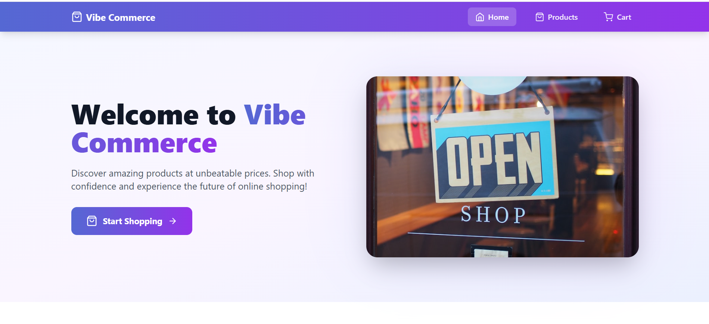
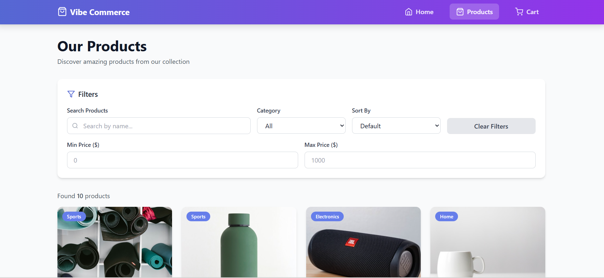
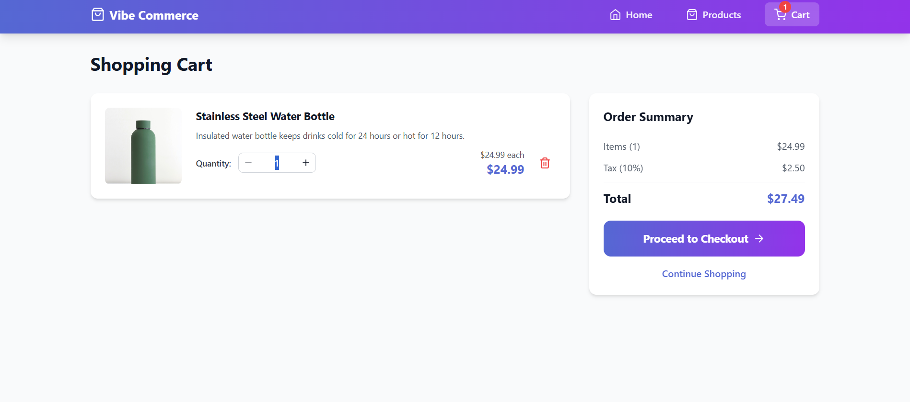
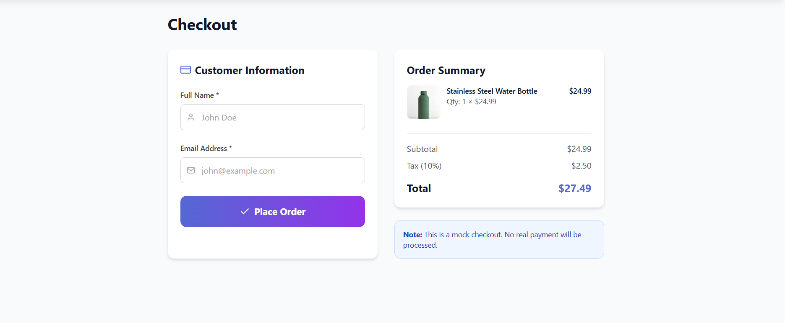
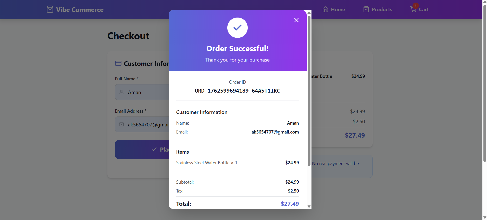

# 🛍️ Vibe Commerce - Full Stack E-Commerce Application

A production-ready, full-stack MERN shopping cart application built for Vibe Commerce internship assessment.


## 📋 Table of Contents

- [Features](#-features)
- [Tech Stack](#-tech-stack)
- [Project Structure](#-project-structure)
- [Installation](#-installation)
- [API Documentation](#-api-documentation)
- [Screenshots](#-screenshots)
- [Testing](#-testing)
- [Deployment](#-deployment)
- [Demo Video](#-demo-video)

## ✨ Features

### Backend Features
✅ RESTful API with Express.js  
✅ MongoDB database with Mongoose ODM  
✅ Complete CRUD operations for products and cart  
✅ Mock checkout system with order generation  
✅ Input validation with express-validator  
✅ Centralized error handling  
✅ Database seeding script  
✅ Production-ready code structure  
✅ Comprehensive API testing suite  

### Frontend Features
✅ Modern React with Hooks and Context API  
✅ Tailwind CSS for beautiful, responsive UI  
✅ Product browsing with advanced filters  
✅ Real-time cart management  
✅ Checkout flow with form validation  
✅ Receipt modal with order details  
✅ Custom alert system  
✅ Loading states and error handling  
✅ Mobile-first responsive design  

## 🛠️ Tech Stack

**Frontend:**
- React 18.3.1
- React Router DOM 6.26.0
- Tailwind CSS 3.4.1
- Axios 1.7.7
- React Icons 5.3.0

**Backend:**
- Node.js
- Express.js 4.18.2
- MongoDB (Mongoose 7.6.3)
- Express Validator 7.0.1
- Helmet, Morgan, CORS

**Development:**
- Nodemon
- Axios for testing

## 📁 Project Structure

```
Mock-E-Cart/
├── backend/
│   ├── controllers/       # Business logic
│   ├── models/            # Database schemas
│   ├── routes/            # API routes
│   ├── middleware/        # Error handling & validation
│   ├── utils/             # Helper functions
│   ├── scripts/           # Database seeding
│   ├── tests/             # Automated API tests
│   ├── server.js          # Entry point
│   └── package.json
│
├── frontend/
│   ├── public/
│   ├── src/
│   │   ├── components/    # Reusable components
│   │   ├── context/       # Global state management
│   │   ├── pages/         # Page components
│   │   ├── services/      # API integration
│   │   ├── App.js
│   │   └── index.js
│   ├── tailwind.config.js
│   └── package.json
│
└── README.md
```

## 🚀 Installation

### Prerequisites
- Node.js v14+ installed
- MongoDB installed and running
- Git installed

### Quick Start

1. **Clone the repository**
```bash
git clone <your-repo-url>
cd Mock-E-Cart
```

2. **Setup Backend**
```bash
cd backend
npm install
cp .env.example .env
# Edit .env with your MongoDB URI
npm run seed
npm run dev
```

Backend will run on `http://localhost:5000`

3. **Setup Frontend** (in a new terminal)
```bash
cd frontend
npm install
cp .env.example .env
npm start
```

Frontend will open at `http://localhost:3000`

### Environment Variables

**Backend (.env):**
```env
NODE_ENV=development
PORT=5000
MONGODB_URI=mongodb://localhost:27017/vibe-commerce
DEFAULT_USER_ID=mock-user-123
CORS_ORIGIN=http://localhost:3000
```

**Frontend (.env):**
```env
REACT_APP_API_URL=http://localhost:5000/api
REACT_APP_USER_ID=mock-user-123
```

## 📡 API Documentation

### Base URL
```
http://localhost:5000/api
```

### Endpoints

#### Products
- `GET /products` - Get all products (with filters)
- `GET /products/:id` - Get single product
- `GET /products/category/:category` - Get products by category

#### Cart
- `GET /cart` - Get user's cart
- `POST /cart` - Add item to cart
- `PUT /cart/:id` - Update cart item quantity
- `DELETE /cart/:id` - Remove item from cart
- `DELETE /cart` - Clear entire cart

#### Checkout
- `POST /checkout` - Process checkout and create order

### Example Request
```bash
curl -X POST http://localhost:5000/api/cart \
  -H "Content-Type: application/json" \
  -H "x-user-id: mock-user-123" \
  -d '{"productId":"PRODUCT_ID","quantity":2}'
```

See [Backend README](backend/README.md) for complete API documentation.

## 📸 Screenshots

### Home Page


### Products Page


### Cart Page


### Checkout & Receipt



*Screenshots to be added after deployment*

## 🧪 Testing

### Backend Testing

**Automated Testing (20 tests):**
```bash
cd backend
npm test
```

Tests cover:
- Health check
- Products API (6 tests)
- Cart API (9 tests)
- Checkout API (5 tests)

**Test Results:**
```
Total Tests: 20
Passed: 20
Failed: 0
Success Rate: 100%
```

See [Testing Guide](backend/tests/TESTING.md) for manual testing instructions.

### Frontend Testing

Manual testing checklist available in [Frontend README](frontend/README.md).

## 🌐 Deployment

### Backend Deployment

1. **MongoDB Atlas:**
   - Create free cluster
   - Get connection string
   - Update `MONGODB_URI` in production

2. **Deploy to:**
   - Heroku
   - Render
   - Railway
   - DigitalOcean

### Frontend Deployment

1. **Build:**
```bash
cd frontend
npm run build
```

2. **Deploy to:**
   - Vercel (recommended)
   - Netlify
   - GitHub Pages
   - AWS S3 + CloudFront

### Environment Setup

Update production environment variables:
- Backend: Point to production MongoDB
- Frontend: Point to production API URL

## 🎥 Demo Video

[Link to 1-2 minute demo video - To be added]

**Demo includes:**
- Application overview
- Adding products to cart
- Updating quantities
- Checkout process
- Receipt generation
- Responsive design showcase

## 📊 Project Highlights

### Code Quality
✅ **Clean Architecture** - MVC pattern, separation of concerns  
✅ **Error Handling** - Centralized middleware  
✅ **Validation** - Input validation on all routes  
✅ **Security** - Helmet, CORS, sanitization  
✅ **Performance** - Database indexing, optimized queries  
✅ **Testing** - Automated test suite  
✅ **Documentation** - Comprehensive READMEs  

### User Experience
✅ **Responsive Design** - Mobile-first approach  
✅ **Loading States** - Smooth feedback  
✅ **Error Messages** - User-friendly alerts  
✅ **Animations** - Smooth transitions  
✅ **Accessibility** - Semantic HTML  

### Technical Features
✅ **State Management** - React Context API  
✅ **API Integration** - Axios with interceptors  
✅ **Routing** - React Router with URL params  
✅ **Styling** - Tailwind CSS utility classes  
✅ **Form Handling** - Validation and error display  

## 🎯 Assessment Requirements

| Requirement | Status |
|------------|--------|
| Backend REST APIs | ✅ Complete |
| MongoDB Integration | ✅ Complete |
| Frontend React App | ✅ Complete |
| Product Grid | ✅ Complete |
| Cart Functionality | ✅ Complete |
| Checkout Form | ✅ Complete |
| Receipt Modal | ✅ Complete |
| Responsive Design | ✅ Complete |
| Error Handling | ✅ Complete |
| GitHub Repository | ✅ Complete |
| README Documentation | ✅ Complete |
| Demo Video | 📝 To be added |

## 🐛 Known Issues

None - All tests passing ✅

## 🔮 Future Enhancements

- [ ] User authentication (JWT)
- [ ] Product reviews and ratings
- [ ] Wishlist functionality
- [ ] Order history
- [ ] Payment gateway integration
- [ ] Admin dashboard
- [ ] Email notifications
- [ ] Product search with Elasticsearch
- [ ] Image uploads
- [ ] Inventory management

## 📝 Notes

- This is a mock e-commerce application for assessment purposes
- No real payments are processed
- Cart data persists in database per mock user ID
- All products are seeded from backend script

## 🤝 Submission

**Repository:** [GitHub Link]  
**Demo Video:** [Loom/YouTube Link]  
**Submission Date:** November 08, 2025

## 👨‍💻 Author

[Your Name]  
Submitted for: Vibe Commerce Internship Assessment

## 📄 License

MIT License - Created for educational/assessment purposes

---

## 🚀 Quick Commands

```bash
# Backend
cd backend
npm install          # Install dependencies
npm run seed         # Seed database
npm run dev          # Start dev server
npm test             # Run tests

# Frontend
cd frontend
npm install          # Install dependencies
npm start            # Start dev server
npm run build        # Production build
```

---

**Built with ❤️ using MERN Stack + Tailwind CSS**

For detailed documentation, see:
- [Backend README](backend/README.md)
- [Frontend README](frontend/README.md)
- [API Testing Guide](backend/tests/TESTING.md)